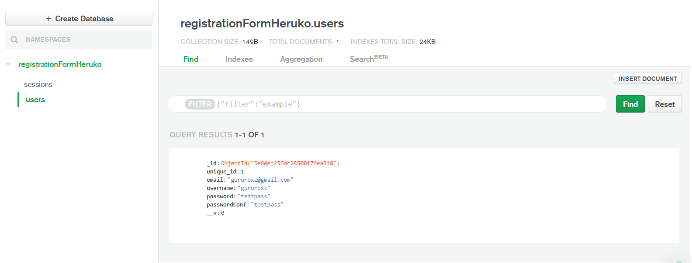
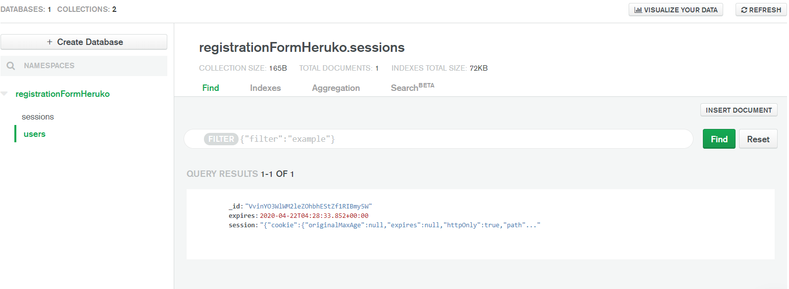

### DataBase:
Here we use **[MongoDB Atlas(Cloud)](https://www.mongodb.com/cloud/atlas)** as the database. Here we have two collection created, named as:
- users.
- sessions.

A Collection(**Users**) is populated with the user's credentials.

<br><br>

A Collection(**session**) is created which stores the users Logged session.


<br>
<br>
<br>

## Prerequisites
Tools that we need to run this app:

- ***[Node.js](https://nodejs.org/en/)***
- ***[Node Package Manager](https://www.npmjs.com/get-npm)***
- ***[MongoDB (Atlas)](https://www.mongodb.com/cloud/atlas)***

## Installing
```
npm install
```
## Connection to DataBase Access
At line 11 on ```./server.js``` change ***```<DB_USERNAME>```*** with your DataBase UserName & ***```<DB_PASSWORD>```*** with your DataBase Password.

## To Run the App
```
node server.js
```

The server will start Running on
+ http://localhost:3000/

